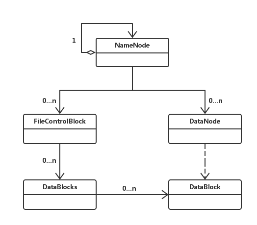

# HDFS简介
HDFS是一个高度容错性的系统，适合部署在廉价的机器上。HDFS能提供高吞吐量的数据访问，非常适合大规模数据集上的应用。HDFS放宽了一部分POSIX约束，来实现流式读取文件系统数据的目的。HDFS在最开始是作为Apache Nutch搜索引擎项目的基础架构而开发的。

# HDFS架构简介
HDFS架构图：


HDFS采用master/slave架构。一个HDFS集群是由一个Namenode和一定数目的Datanodes组成。Namenode是一个中心服务器，负责管理文件系统的名字空间(namespace)以及客户端对文件的访问。集群中的Datanode一般是一个节点一个，负责管理它所在节点上的存储。HDFS暴露了文件系统的名字空间，用户能够以文件的形式在上面存储数据。从内部看，一个文件其实被分成一个或多个数据块，这些块存储在一组Datanode上。Namenode执行文件系统的名字空间操作，比如打开、关闭、重命名文件或目录。它也负责确定数据块到具体Datanode节点的映射。Datanode负责处理文件系统客户端的读写请求。在Namenode的统一调度下进行数据块的创建、删除和复制。

Namenode和Datanode被设计成可以在普通的商用机器上运行。这些机器一般运行着GNU/Linux操作系统(OS)。HDFS采用Java语言开发，因此任何支持Java的机器都可以部署Namenode或Datanode。由于采用了可移植性极强的Java语言，使得HDFS可以部署到多种类型的机器上。**一个典型的部署场景是一台机器上只运行一个Namenode实例，而集群中的其它机器分别运行一个Datanode实例**。这种架构并不排斥在一台机器上运行多个Datanode，只不过这样的情况比较少见。
集群中单一Namenode的结构大大简化了系统的架构。Namenode是所有HDFS元数据的仲裁者和管理者，这样，**用户数据永远不会流过Namenode**。

参考链接：[http://hadoop.apache.org/docs/r1.0.4/cn/hdfs_design.html](http://hadoop.apache.org/docs/r1.0.4/cn/hdfs_design.html)

# 简单模拟HDFS(Hadoop FileSystem)
该仓库源于本人的操作系统课程设计，用多个文件模拟集群下的多个节点，实现一个文件由NameNode分解成多个数据块，并映射到对应的DataNode，再将其以及其副本存储在多个DataNode的功能。

## 简单类图


说明：如图所示，`NameNode`和`DataNode`分别代表对应的Namenode和Datanode，`FileControlBlock`表示文件控制块，它封装了文件的元数据以及切分后的数据块集合。`DataBlock`代表切分后的数据块，它包含了它所在的`DataNode`的位置，文件的部分数据。`DataBlocks`是为了提高容错性而实现的，它封装了一个主要数据块，还有其他的副本数据块。

## 主要API
```java
// 保存文件
public boolean saveFile(String namespace, String name, 
			InputStream inputStream, int level);
```
其中level为副本等级，表示创建相应个数的副本，例如level=3,那么会为每个数据块创建3个副本。

```java
// 读取文件
public InputStream openFile(String namespace, String name);
```

## 提高容错性的简单实现
如上所述，在保存文件的时候会为数据块创建指定数目的副本，并保存在不同的`DataNode`下。
在读取文件的时候，会先读取主数据块的数据，当发生异常时，可以去读取其他`DataNode`下的副本数据块，从而提高了容错性。